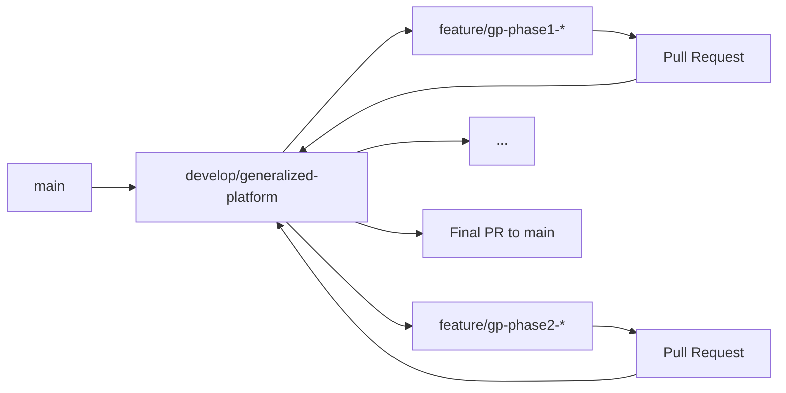

# Generalized Platform Development Workflow

## Overview

This document defines the strict branching and development workflow for transforming the Cardinal Vote voting platform into a generalized multi-tenant voting service while maintaining the stability of the current production system.

## Branch Structure

```
main (production - Cardinal Vote logos voting)
│
└── develop/generalized-platform (integration branch for generalized version)
    ├── feature/gp-phase1-database (Phase 1: Database migration)
    ├── feature/gp-phase1-auth (Phase 1: Authentication system)
    ├── feature/gp-phase2-vote-creation (Phase 2: Vote creation)
    ├── feature/gp-phase2-media (Phase 2: Media uploads)
    ├── feature/gp-phase3-voting (Phase 3: Enhanced voting)
    ├── feature/gp-phase3-security (Phase 3: CAPTCHA & security)
    ├── feature/gp-phase4-results (Phase 4: Results dashboard)
    ├── feature/gp-phase4-export (Phase 4: Data export)
    ├── feature/gp-phase5-admin (Phase 5: Admin panel)
    └── feature/gp-phase5-production (Phase 5: Production readiness)
```

## Workflow Rules

### 1. Branch Naming Convention

All branches for the generalized platform MUST follow this pattern:

- `feature/gp-phase{N}-{feature-name}` - For phase-specific features
- `bugfix/gp-{issue-description}` - For bug fixes in generalized platform
- `test/gp-{test-description}` - For testing branches

**GP prefix = Generalized Platform** (to distinguish from main branch features)

### 2. Development Flow



### 3. Strict Rules

#### NEVER:

- ❌ Branch directly from `main` for generalized platform work
- ❌ Merge directly to `main` from feature branches
- ❌ Skip the `develop/generalized-platform` integration branch
- ❌ Mix Cardinal Vote-specific fixes with generalized platform development

#### ALWAYS:

- ✅ Branch from `develop/generalized-platform` for new features
- ✅ Create PRs to `develop/generalized-platform` for review
- ✅ Run full test suite before merging to integration branch
- ✅ Keep `develop/generalized-platform` deployable at all times
- ✅ Document database migrations and breaking changes

### 4. Phase-Based Development

According to the PRP, development follows these phases:

#### Phase 1: Foundation (Weeks 1-3)

```bash
# Week 1: Database Migration
git checkout develop/generalized-platform
git checkout -b feature/gp-phase1-database

# Week 2: User Management
git checkout develop/generalized-platform
git checkout -b feature/gp-phase1-auth

# Week 3: Basic Vote Creation
git checkout develop/generalized-platform
git checkout -b feature/gp-phase1-vote-basic
```

#### Phase 2: Vote Creation & Management (Weeks 4-6)

```bash
# Week 4: Vote Creation Wizard
git checkout develop/generalized-platform
git checkout -b feature/gp-phase2-vote-wizard

# Week 5: Media Upload System
git checkout develop/generalized-platform
git checkout -b feature/gp-phase2-media

# Week 6: Vote Management Dashboard
git checkout develop/generalized-platform
git checkout -b feature/gp-phase2-dashboard
```

#### Phase 3: Enhanced Voting Experience (Weeks 7-8)

```bash
# Week 7: Voting Interface Enhancement
git checkout develop/generalized-platform
git checkout -b feature/gp-phase3-voting-ui

# Week 8: Security & Anti-Spam
git checkout develop/generalized-platform
git checkout -b feature/gp-phase3-security
```

#### Phase 4: Results & Analytics (Weeks 9-10)

```bash
# Week 9: Results Dashboard
git checkout develop/generalized-platform
git checkout -b feature/gp-phase4-results

# Week 10: Data Export & Reporting
git checkout develop/generalized-platform
git checkout -b feature/gp-phase4-export
```

#### Phase 5: Admin & Platform Management (Weeks 11-12)

```bash
# Week 11: Super Admin Functions
git checkout develop/generalized-platform
git checkout -b feature/gp-phase5-admin

# Week 12: Polish & Production Readiness
git checkout develop/generalized-platform
git checkout -b feature/gp-phase5-production
```

### 5. Pull Request Process

#### For Feature Branches → develop/generalized-platform

1. **Create PR with template**:

```markdown
## Phase & Week

Phase X, Week Y: [Feature Name]

## PRP Section Reference

Links to relevant PRP sections

## Changes

- List of changes implemented

## Testing

- [ ] Unit tests added/updated
- [ ] Integration tests passing
- [ ] Manual testing completed
- [ ] Database migrations tested

## Breaking Changes

List any breaking changes or migrations required

## Screenshots

If applicable, add screenshots
```

2. **Required Checks**:

- All CI/CD tests pass
- Code review approved
- No conflicts with develop/generalized-platform
- Documentation updated

3. **Merge Strategy**:

- Squash and merge for feature branches
- Clear commit message referencing PRP phase

#### For develop/generalized-platform → main (Final)

1. **Comprehensive PR**:

- Full changelog of all phases
- Migration guide from Cardinal Vote version
- Performance comparison
- Security audit results

2. **Testing Requirements**:

- Full regression testing
- Load testing results
- User acceptance testing
- Rollback plan documented

### 6. Parallel Maintenance

While developing the generalized platform, the main branch may need updates:

#### For Cardinal Vote-specific fixes:

```bash
git checkout main
git checkout -b hotfix/cardinal-vote-{issue}
# Fix issue
git push
# PR to main
```

#### To sync fixes to generalized platform:

```bash
git checkout develop/generalized-platform
git merge main
# Resolve any conflicts
git push
```

### 7. Testing Strategy

Each phase merge to `develop/generalized-platform` must include:

1. **Phase-Specific Tests**:
   - Unit tests for new functionality
   - Integration tests for phase features
   - Regression tests for previous phases

2. **End-to-End Testing**:
   - Complete user journey testing
   - Cross-browser compatibility
   - Mobile responsiveness

3. **Performance Testing**:
   - Load testing with expected user volume
   - Database query optimization
   - API response time validation

### 8. Documentation Requirements

Each phase must update:

1. **Technical Documentation**:
   - API documentation (OpenAPI/Swagger)
   - Database schema changes
   - Deployment guide updates

2. **User Documentation**:
   - User guides for new features
   - Admin documentation
   - Migration guides

### 9. Rollback Strategy

If issues arise in `develop/generalized-platform`:

1. **Immediate Rollback**:

```bash
git checkout develop/generalized-platform
git revert <commit-hash>
git push
```

2. **Phase Rollback**:

```bash
# Identify the last stable phase merge
git checkout develop/generalized-platform
git reset --hard <last-stable-commit>
git push --force-with-lease
```

3. **Emergency Main Protection**:

- Main branch remains untouched until final validation
- Can deploy from main at any time for critical fixes

### 10. Progress Tracking

Use GitHub Projects or Issues to track:

- [ ] Phase 1: Foundation & Authentication
  - [ ] Database Migration
  - [ ] User Management System
  - [ ] Basic Vote Creation
- [ ] Phase 2: Vote Creation & Management
  - [ ] Vote Creation Wizard
  - [ ] Media Upload System
  - [ ] Vote Management Dashboard
- [ ] Phase 3: Enhanced Voting Experience
  - [ ] Voting Interface Enhancement
  - [ ] Security & Anti-Spam
- [ ] Phase 4: Results & Analytics
  - [ ] Results Dashboard
  - [ ] Data Export & Reporting
- [ ] Phase 5: Admin & Platform Management
  - [ ] Super Admin Functions
  - [ ] Production Readiness

### 11. Communication

#### Weekly Updates:

- Progress on current phase
- Blockers or issues
- Next week's objectives
- Any changes to PRP

#### Phase Completion:

- Phase retrospective
- Lessons learned
- PRP adjustments if needed
- Next phase planning

## Commands Quick Reference

```bash
# Start new phase feature
git checkout develop/generalized-platform
git pull origin develop/generalized-platform
git checkout -b feature/gp-phaseX-feature-name

# Complete feature
git add .
git commit -m "feat(phaseX): implement feature-name

- Added functionality per PRP section X.Y
- Updated tests and documentation
- Refs: #issue-number"

git push -u origin feature/gp-phaseX-feature-name
# Create PR to develop/generalized-platform

# Sync with main if needed
git checkout develop/generalized-platform
git merge main
git push

# Final merge to main (after all phases)
git checkout main
git merge develop/generalized-platform
git push
```

## Success Criteria

Before merging `develop/generalized-platform` to `main`:

- [ ] All 5 phases completed and tested
- [ ] Migration from Cardinal Vote version documented and tested
- [ ] Performance meets or exceeds current version
- [ ] Security audit passed
- [ ] User documentation complete
- [ ] Rollback plan tested
- [ ] Stakeholder approval received

---

**Document Status**: Active  
**Workflow Start Date**: [To be added]  
**Target Completion**: 12 weeks from start  
**Next Action**: Begin Phase 1 - Database Migration
