# Cardinal Vote Platform - Architecture Overview

## Table of Contents

1. [System Overview](#system-overview)
2. [Application Layers](#application-layers)
3. [File Structure Mapping](#file-structure-mapping)
4. [Layer Completion Status](#layer-completion-status)
5. [Technology Stack](#technology-stack)
6. [API Architecture](#api-architecture)

## System Overview

Cardinal Vote is a generalized voting platform built with a multi-layered architecture that separates concerns between public interfaces, user management, voting operations, and platform administration.

### Core Architecture Principles

- **Separation of Concerns**: Each layer has distinct responsibilities
- **RESTful API Design**: All operations exposed through API endpoints
- **Template-based UI**: Server-side rendering with Jinja2 templates
- **Modular Router System**: Separate routers for different functional areas
- **Role-based Access Control**: Different access levels for public, users, and admins

## Application Layers

### 1. Public Landing Page Layer

**Purpose**: Public-facing marketing and information page
**Access Level**: Public (No authentication required)
**URL Pattern**: `/`

#### Frontend Files:

- **Templates**:
  - `templates/landing_material.html` (Material Design version - Active)
  - `templates/landing.html` (Legacy version)
- **Styles**:
  - `static/css/material-design.css` (MD3 foundation)
  - `static/css/landing-material.css` (Landing specific)
- **Scripts**:
  - `static/js/landing-material.js` (Interactive features)
  - `static/landing.js` (Legacy)

#### Backend Files:

- **Route Handler**: `main.py` line 262
  - Endpoint: `GET /`
  - Function: `home()`

---

### 2. User Admin Panel Layer

**Purpose**: Vote creation and management for registered users
**Access Level**: Authenticated users only
**URL Pattern**: `/api/auth/*`, `/api/votes/*` (API-only, no web interface)

#### Frontend Files:

- **Templates**: None found (❌ Missing - API-only currently)
- **Styles**:
  - `static/css/admin.css` (Admin panel styling)
- **Scripts**:
  - `static/js/admin.js` (Admin functionality)
  - `static/js/admin-auth.js` (Authentication handling)
  - `static/js/event-handlers.js` (Event management)
  - `static/js/html-sanitizer.js` (Security)

#### Backend Files:

- **Route Handlers**:
  - `auth_routes.py` (Authentication endpoints - Prefix: `/api/auth`)
    - `POST /api/auth/register` - User registration
    - `POST /api/auth/token` - OAuth2 token endpoint (form-data)
    - `POST /api/auth/login` - User login (JSON data)
    - `GET /api/auth/me` - Current user info
    - `POST /api/auth/refresh` - Token refresh
    - `POST /api/auth/request-password-reset` - Password reset
    - `POST /api/auth/reset-password` - Reset password with token
    - `POST /api/auth/verify-email` - Email verification
    - `POST /api/auth/resend-verification` - Resend verification

  - `vote_routes.py` (Vote management endpoints - Prefix: `/api/votes`)
    - `POST /api/votes/` - Create vote with options
    - `GET /api/votes/` - List user's votes (paginated)
    - `GET /api/votes/{vote_id}` - Get specific vote
    - `PUT /api/votes/{vote_id}` - Update vote basic information
    - `PATCH /api/votes/{vote_id}/status` - Update vote status (draft/active/closed)
    - `DELETE /api/votes/{vote_id}` - Delete vote and associated data
    - `GET /api/votes/public/{slug}` - Get public vote by slug
    - `POST /api/votes/public/{slug}/submit` - Submit anonymous vote
    - `POST /api/votes/{vote_id}/submit` - Submit authenticated vote
    - `GET /api/votes/{vote_id}/results` - Vote results and analytics
    - `GET /api/votes/{vote_id}/export` - Export vote data (CSV/JSON)
    - `GET /api/votes/dashboard/stats` - User dashboard statistics
    - `POST /api/votes/images/upload` - Upload image for vote options
    - `DELETE /api/votes/images/{filename}` - Delete uploaded image
    - `GET /api/votes/images/{filename}/info` - Get image metadata

- **Manager Classes**:
  - `auth_manager.py` - GeneralizedAuthManager
  - `vote_moderation_manager.py` - VoteModerationManager
  - `database_manager.py` - GeneralizedDatabaseManager
  - `session_manager.py` - MultiTenantSessionManager

---

### 3. Public Voting Page Layer

**Purpose**: Interface for participants to cast votes
**Access Level**: Public (No authentication, but requires valid vote slug)
**URL Pattern**: `/vote/{slug}`

#### Frontend Files:

- **Templates**:
  - `templates/public_vote.html` (Voting interface)
- **Styles**:
  - `static/public_vote.css` (Voting page styles)
  - `static/style.css` (General styles)
- **Scripts**:
  - `static/public_vote.js` (Voting functionality)

#### Backend Files:

- **Route Handlers**:
  - `main.py` line 282
    - Endpoint: `GET /vote/{slug}`
    - Function: `public_vote_page()`

  - `vote_routes.py`
    - `GET /api/votes/public/{slug}` - Get public vote data
    - `POST /api/votes/public/{slug}/submit` - Submit anonymous vote (IP-based duplicate prevention)
    - `POST /api/votes/{vote_id}/submit` - Submit authenticated vote (user-based duplicate prevention)

---

### 4. Super Admin Panel Layer

**Purpose**: Platform administration and moderation
**Access Level**: Super admin only (Platform host)
**URL Pattern**: `/api/admin/*`

#### Frontend Files:

- **Templates**:
  - `templates/super_admin/base.html` (Base template)
  - `templates/super_admin/dashboard.html` (Main dashboard)
  - `templates/super_admin/moderation.html` (Moderation interface)
- **Styles**:
  - `static/css/super-admin.css` (Super admin styles)
  - `static/css/fontawesome.css` (Icon library)
- **Scripts**:
  - `static/js/super-admin.js` (Super admin functionality)

#### Backend Files:

- **Route Handlers**:
  - `super_admin_routes.py` (Prefix: `/api/admin`)
    - `GET /api/admin/dashboard` - Super admin dashboard page
    - `GET /api/admin/stats` - System statistics
    - `GET /api/admin/comprehensive-stats` - Comprehensive statistics
    - `GET /api/admin/users` - List all users (paginated)
    - `GET /api/admin/users/{user_id}` - Get user details
    - `POST /api/admin/users/manage` - User management actions
    - `POST /api/admin/users/bulk-update` - Bulk user operations
    - `GET /api/admin/recent-activity` - Recent user activity
    - `GET /api/admin/user-summary` - User management summary
    - `GET /api/admin/audit-log` - Platform audit log
    - `GET /api/admin/moderation/dashboard` - Moderation dashboard
    - `GET /api/admin/moderation/flags` - Get pending flags
    - `POST /api/admin/moderation/flags/{flag_id}/review` - Review flag
    - `GET /api/admin/moderation/votes` - Get flagged votes
    - `GET /api/admin/moderation/votes/{vote_id}` - Get vote moderation summary
    - `POST /api/admin/moderation/votes/{vote_id}/action` - Take moderation action
    - `POST /api/admin/moderation/bulk-action` - Bulk moderation actions
    - `POST /api/admin/flag-vote/{vote_id}` - Flag vote for moderation (public endpoint)

- **Manager Classes**:
  - `super_admin_manager.py` - SuperAdminManager
  - `vote_moderation_manager.py` - VoteModerationManager

---

### 5. API Layer

**Purpose**: Backend API powering all frontend interactions
**Access Level**: Varies by endpoint
**URL Pattern**: `/api/*`

#### Backend Files:

- **Main Application**:
  - `main.py` - FastAPI application setup
  - `config.py` - Configuration management
  - `database_manager.py` - Database operations
  - `models.py` - Data models and schemas

- **Supporting Services**:
  - `dependencies.py` - Dependency injection and authentication
  - `session_manager.py` - Multi-tenant session management
  - `rate_limiting.py` - Comprehensive rate limiting
  - `email_service.py` - Email functionality (SMTP/Mock)
  - `captcha_service.py` - CAPTCHA verification (reCAPTCHA/hCAPTCHA/Mock)
  - `image_service.py` - Image upload and processing
  - `input_sanitizer.py` - Input validation and XSS prevention
  - `env_validator.py` - Environment configuration validation

---

## File Structure Mapping

```
cardinal-vote-voting/
├── src/cardinal_vote/
│   ├── main.py                    # Main FastAPI application
│   ├── auth_routes.py             # Authentication endpoints
│   ├── vote_routes.py             # Vote management endpoints
│   ├── super_admin_routes.py      # Super admin endpoints
│   ├── auth_manager.py            # Authentication logic
│   ├── super_admin_manager.py     # Super admin logic
│   ├── vote_moderation_manager.py # Moderation logic
│   ├── database_manager.py        # Database operations
│   ├── models.py                  # Data models
│   ├── config.py                  # Configuration
│   └── [supporting services]      # Various utility services
│
├── templates/
│   ├── landing_material.html      # Public landing page (Material Design)
│   ├── landing.html               # Legacy landing page
│   ├── public_vote.html           # Public voting interface
│   └── super_admin/
│       ├── base.html              # Super admin base template
│       ├── dashboard.html         # Super admin dashboard
│       └── moderation.html        # Moderation interface
│
└── static/
    ├── css/
    │   ├── material-design.css    # MD3 foundation
    │   ├── landing-material.css   # Landing page styles
    │   ├── admin.css              # Admin panel styles
    │   ├── super-admin.css        # Super admin styles
    │   ├── public_vote.css        # Voting page styles
    │   └── style.css              # General styles
    └── js/
        ├── landing-material.js    # Landing page scripts
        ├── admin.js               # Admin functionality
        ├── admin-auth.js          # Auth handling
        ├── super-admin.js         # Super admin scripts
        └── public_vote.js         # Voting scripts
```

## Layer Completion Status

### 🟢 Complete (Functional and Styled)

- **Public Landing Page**: ✅ 100% Complete
  - Full Material Design 3 implementation
  - Responsive design
  - Interactive features with navigation drawer, FAB, snackbar
  - Clean, modern UI with proper CSP compliance
  - Authentication modals integrated

- **Super Admin Panel**: ✅ 90% Complete
  - Full dashboard implementation with real-time statistics
  - Complete user management with bulk operations
  - Comprehensive moderation tools with flag review
  - Platform monitoring and audit logs
  - Professional admin styling with FontAwesome icons
  - _Note: Could benefit from Material Design update_

### 🟡 Partially Complete (Functional but needs UI improvements)

- **Public Voting Page**: 🟡 75% Complete
  - ✅ Backend fully functional with anonymous and authenticated voting
  - ✅ Complete HTML template with multi-screen wizard
  - ✅ Accessibility-compliant design with WCAG 2.1 AA
  - ✅ CAPTCHA integration for anonymous voting
  - ✅ Responsive design with mobile-first approach
  - ❌ Could benefit from Material Design styling consistency
  - ❌ Could use enhanced visual feedback and animations

### 🔴 Critical Gap (Missing Web Interface)

- **User Admin Panel**: 🔴 30% Complete
  - ✅ Backend API comprehensive with 14 endpoints
  - ✅ Complete authentication system with JWT
  - ✅ Vote CRUD operations fully functional
  - ✅ Image upload and management system
  - ✅ Dashboard statistics and analytics
  - ❌ NO HTML templates for user interface
  - ❌ NO web pages for vote creation/management
  - ❌ NO UI for viewing results or exporting data
  - ⚠️ **CRITICAL**: Users can only access via direct API calls
  - _This represents the largest architectural gap in the platform_

### 🟡 Supporting Infrastructure

- **API Layer**: ✅ 95% Complete
  - 39 total endpoints across all routers
  - Comprehensive authentication with OAuth2 compliance
  - Multi-tenant architecture with Row-Level Security
  - Advanced rate limiting with endpoint-specific rules
  - Security headers middleware with CSP
  - Input sanitization and XSS prevention
  - Email service with SMTP/Mock backends
  - CAPTCHA service with multiple provider support
  - Image processing with automatic optimization

## Technology Stack

### Backend

- **Framework**: FastAPI (Python 3.11+) with async/await support
- **Database**: PostgreSQL 16+ with AsyncPG driver
- **ORM**: SQLAlchemy (async) with declarative base
- **Authentication**: JWT tokens (access + refresh) with OAuth2 compliance
- **Authorization**: Row-Level Security (RLS) with multi-tenant support
- **Templating**: Jinja2 with security-focused rendering
- **Session Management**: Multi-tenant session context with PostgreSQL integration
- **Rate Limiting**: Comprehensive endpoint-specific rate limiting
- **Email**: aiosmtplib with SMTP/Mock backend support
- **Image Processing**: Pillow (PIL) with automatic optimization
- **Security**: bcrypt password hashing, input sanitization, XSS prevention

### Frontend

- **HTML Templates**: Jinja2 server-side rendering with CSP compliance
- **Design Systems**:
  - Material Design 3 (landing page)
  - Eco-friendly theme (voting interface)
  - Professional admin theme (super admin)
- **CSS**: Modern CSS with custom properties, CSS Grid/Flexbox
- **JavaScript**: ES6+ with class-based architecture for complex apps
- **Icons**: Material Icons, Font Awesome
- **Fonts**: Inter font (Google Fonts), system font fallbacks
- **Accessibility**: WCAG 2.1 AA compliant with reduced motion support

### Security

- **Content Security Policy**: Strict CSP with no unsafe-inline
- **Security Headers**: Comprehensive security header implementation
- **Input Validation**: Multi-layer input sanitization and validation
- **CAPTCHA**: reCAPTCHA v2, hCAPTCHA, and mock service support
- **Rate Limiting**: IP-based with sliding window algorithm
- **File Upload**: Secure image processing with content validation

### Database Architecture

- **Multi-tenancy**: PostgreSQL Row-Level Security policies
- **Extensions**: CITEXT, UUID-OSSP for enhanced functionality
- **Indexing**: Strategic indexing for performance optimization
- **Connection Pooling**: Configurable connection pools for scalability
- **Migrations**: Automated schema management

### Deployment

- **Containerization**: Multi-stage Docker builds
- **Web Server**: Uvicorn ASGI server
- **Process Manager**: Tini for proper signal handling
- **Environment Management**: python-dotenv with comprehensive validation
- **Health Checks**: Application and database health monitoring
- **Logging**: Structured logging with security event tracking

## API Architecture

### Authentication Flow

1. User registers via `POST /api/auth/register`
2. User logs in via `POST /api/auth/login` or `POST /api/auth/token` → receives JWT tokens (access + refresh)
3. Access token included in Authorization header for protected endpoints
4. Token refresh available via `POST /api/auth/refresh` using refresh token
5. Email verification via `POST /api/auth/verify-email`
6. Password reset via `POST /api/auth/request-password-reset` and `POST /api/auth/reset-password`

### Vote Lifecycle

1. **Creation**: Authenticated user creates vote via `POST /api/votes/` with options
2. **Configuration**: User updates vote settings via `PUT /api/votes/{id}` and `PATCH /api/votes/{id}/status`
3. **Publishing**: Vote status changed to 'active' and becomes accessible via public slug
4. **Participation**:
   - Anonymous users submit votes via `POST /api/votes/public/{slug}/submit` (IP-based duplicate prevention)
   - Authenticated users submit votes via `POST /api/votes/{vote_id}/submit` (user-based duplicate prevention)
5. **Results**: Creator views results via `GET /api/votes/{vote_id}/results`
6. **Export**: Data exportable via `GET /api/votes/{vote_id}/export` (CSV/JSON formats)
7. **Management**: Images uploaded via `POST /api/votes/images/upload`

### Permission Levels

- **Public**: Landing page, public vote pages, anonymous voting, vote flagging
- **Authenticated User**: Vote creation/management, authenticated voting, image uploads, results viewing
- **Super Admin**: Full platform control, user management, content moderation, system statistics

## Missing Web Interface Analysis

### Critical Finding: User Management Gap

The architecture analysis reveals a significant gap in the user-facing web interface:

**What Exists (Backend)**:

- 14 comprehensive API endpoints for vote management
- Complete authentication system with JWT tokens
- Image upload and processing capabilities
- Dashboard statistics and analytics
- Data export functionality (CSV/JSON)
- Vote CRUD operations with status management

**What's Missing (Frontend)**:

- No HTML templates for user dashboard
- No vote creation interface
- No vote management pages
- No results visualization
- No image upload UI
- No user profile management

**Current User Journey Problem**:

1. User registers/logs in via landing page modals ✅
2. User receives JWT tokens ✅
3. User is redirected to... **NOTHING** ❌
4. User must use external API client or build own frontend ❌

This represents approximately 60% of the expected user functionality missing from the web interface.

---

## Layer Relation Mapping

### System Architecture Flow

```mermaid
graph TB
    %% External Users
    Public[Public Users] --> Landing[Landing Page Layer]
    Voters[Vote Participants] --> VotePage[Public Voting Page Layer]
    Users[Registered Users] --> UserAdmin[User Admin Panel Layer]
    SuperAdmin[Platform Host] --> SuperAdminPanel[Super Admin Panel Layer]

    %% Landing Page Layer
    Landing --> |Register/Login| Auth[Authentication System]
    Landing --> |Marketing Info| LandingTemplate[landing_material.html]
    LandingTemplate --> |Styles| LandingCSS[landing-material.css]
    LandingTemplate --> |Interactivity| LandingJS[landing-material.js]

    %% Authentication Flow
    Auth --> |JWT Tokens| AuthAPI[auth_routes.py]
    AuthAPI --> |User Management| AuthManager[auth_manager.py]
    AuthManager --> |Database| PostgreSQL[(PostgreSQL Database)]

    %% User Admin Panel Layer (❌ CRITICAL: Missing Frontend)
    UserAdmin -.-> |NO WEB INTERFACE| MissingUI[❌ Missing Templates]
    UserAdmin --> |API Only| VoteAPI[vote_routes.py]
    VoteAPI --> |Vote Logic| VoteManager[vote_moderation_manager.py]
    VoteManager --> PostgreSQL

    %% Public Voting Page Layer
    VotePage --> |Vote Display| VoteTemplate[public_vote.html]
    VoteTemplate --> |Voting Logic| VoteJS[public_vote.js]
    VoteTemplate --> |Styles| VoteCSS[public_vote.css]
    VotePage --> |Submit Votes| VoteAPI

    %% Super Admin Panel Layer
    SuperAdminPanel --> |Admin Interface| AdminTemplate[super_admin/dashboard.html]
    AdminTemplate --> |Admin Logic| AdminJS[super-admin.js]
    AdminTemplate --> |Admin Styles| AdminCSS[super-admin.css]
    SuperAdminPanel --> |Admin Operations| SuperAdminAPI[super_admin_routes.py]
    SuperAdminAPI --> |Platform Management| SuperAdminManager[super_admin_manager.py]
    SuperAdminManager --> PostgreSQL

    %% API Layer (Backend Infrastructure)
    AuthAPI --> |Core App| FastAPI[main.py - FastAPI App]
    VoteAPI --> FastAPI
    SuperAdminAPI --> FastAPI
    FastAPI --> |Configuration| Config[config.py]
    FastAPI --> |Database Connection| DBManager[database_manager.py]
    DBManager --> PostgreSQL

    %% Static Resources
    FastAPI --> |Serve Static| StaticFiles[/static/* files]
    FastAPI --> |File Uploads| Uploads[/uploads/* files]

    %% Styling and Theming
    classDef complete fill:#4CAF50,stroke:#2E7D32,color:white
    classDef partial fill:#FF9800,stroke:#F57C00,color:white
    classDef missing fill:#F44336,stroke:#C62828,color:white
    classDef infrastructure fill:#2196F3,stroke:#1976D2,color:white

    class Landing,LandingTemplate,LandingCSS,LandingJS complete
    class SuperAdminPanel,AdminTemplate,AdminJS,AdminCSS,SuperAdminAPI,SuperAdminManager complete
    class VotePage,VoteTemplate,VoteJS,VoteCSS partial
    class UserAdmin,MissingUI missing
    class Auth,AuthAPI,AuthManager,VoteAPI,VoteManager,FastAPI,Config,DBManager,PostgreSQL infrastructure
```

### Authentication and Authorization Flow


### Vote Lifecycle Flow

```mermaid
flowchart LR
    %% Vote Creation (Missing Web UI)
    Creator[Vote Creator] --> |API Only| CreateAPI[POST /api/votes/]
    CreateAPI --> |Store| DB[(Database)]

    %% Vote Configuration
    DB --> |Vote Data| ConfigAPI[PUT /api/votes/{id}]
    ConfigAPI --> |Update| DB

    %% Publishing
    DB --> |Generate Slug| PublicURL[/vote/{slug}]

    %% Public Access
    Participants[Vote Participants] --> PublicURL
    PublicURL --> |Render| VotePage[public_vote.html]
    VotePage --> |Submit| SubmitAPI[POST /api/votes/{id}/submit]
    SubmitAPI --> |Store| DB

    %% Results (API Only)
    Creator --> |API Only| ResultsAPI[GET /api/votes/{id}/results]
    ResultsAPI --> |Query| DB
    DB --> |Results| Creator

    %% Super Admin Oversight
    SuperAdmin[Super Admin] --> |Web UI| AdminPanel[super_admin/dashboard.html]
    AdminPanel --> |Monitor| ModAPI[super_admin_routes.py]
    ModAPI --> |Access| DB

    %% Styling
    classDef missing fill:#F44336,stroke:#C62828,color:white
    classDef partial fill:#FF9800,stroke:#F57C00,color:white
    classDef complete fill:#4CAF50,stroke:#2E7D32,color:white

    class CreateAPI,ConfigAPI,ResultsAPI missing
    class VotePage,PublicURL partial
    class AdminPanel,ModAPI complete
```

### Data Flow and Dependencies

```mermaid
graph LR
    %% Frontend Templates
    subgraph "Frontend Layer"
        LT[landing_material.html]
        VT[public_vote.html]
        SAT[super_admin/*.html]
        MISSING[❌ User Admin Templates]
    end

    %% API Routes
    subgraph "API Layer"
        AR[auth_routes.py]
        VR[vote_routes.py]
        SAR[super_admin_routes.py]
    end

    %% Business Logic
    subgraph "Business Logic"
        AM[auth_manager.py]
        VM[vote_moderation_manager.py]
        SAM[super_admin_manager.py]
    end

    %% Data Layer
    subgraph "Data Layer"
        DB[database_manager.py]
        M[models.py]
        PG[(PostgreSQL)]
    end

    %% Connections
    LT --> AR
    VT --> VR
    SAT --> SAR
    MISSING -.-> VR

    AR --> AM
    VR --> VM
    SAR --> SAM

    AM --> DB
    VM --> DB
    SAM --> DB

    DB --> M
    M --> PG

    %% Styling
    classDef missing fill:#F44336,stroke:#C62828,color:white,stroke-dasharray: 5 5
    classDef partial fill:#FF9800,stroke:#F57C00,color:white
    classDef complete fill:#4CAF50,stroke:#2E7D32,color:white
    classDef infrastructure fill:#2196F3,stroke:#1976D2,color:white

    class LT,SAT,SAR,SAM complete
    class VT,VR,VM partial
    class MISSING missing
    class AR,AM,DB,M,PG infrastructure
```



## Critical Gaps and Recommendations

### 🚨 Priority 1: User Admin Panel Frontend (CRITICAL)

The user admin panel has NO web interface despite comprehensive backend API. Users cannot:

- Create votes through a web interface (must use direct API calls)
- Manage their votes visually
- View vote results in a user-friendly format
- Export data through the web
- Upload images for vote options via web UI
- Monitor vote statistics through dashboard

**Impact**: This is the most significant architectural gap. Users must either:

- Build their own frontend client
- Use direct API calls (not user-friendly)
- Rely on external tools for vote management

**Recommendation**: Implement complete web interface with:

- Material Design 3 consistency
- Vote creation wizard with image upload
- Dashboard for vote management
- Real-time results visualization
- Data export functionality

### ⚠️ Priority 2: Design System Unification

Three different design systems currently in use:

- Material Design 3 (landing page) - modern and polished
- Eco-friendly theme (voting page) - functional but inconsistent
- Professional admin theme (super admin) - adequate but dated

**Recommendation**: Standardize on Material Design 3 across all interfaces while maintaining accessibility.

### 💡 Priority 3: Enhanced User Experience

Current voting interface is functional but could be improved:

- Better visual feedback during voting process
- Enhanced animations and transitions
- Improved mobile touch targets
- Better loading states and error handling

**Recommendation**: Apply UX enhancements while maintaining accessibility compliance.

### 📱 Priority 4: Progressive Web App Features

Current implementation is web-responsive but lacks PWA features:

- No offline capability
- No app-like installation
- No push notifications for vote creators

**Recommendation**: Consider PWA implementation for enhanced user experience.
